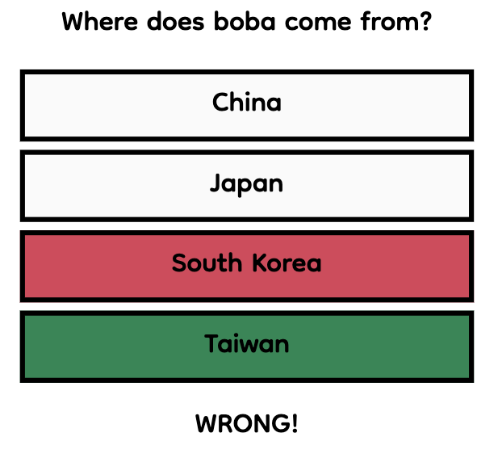
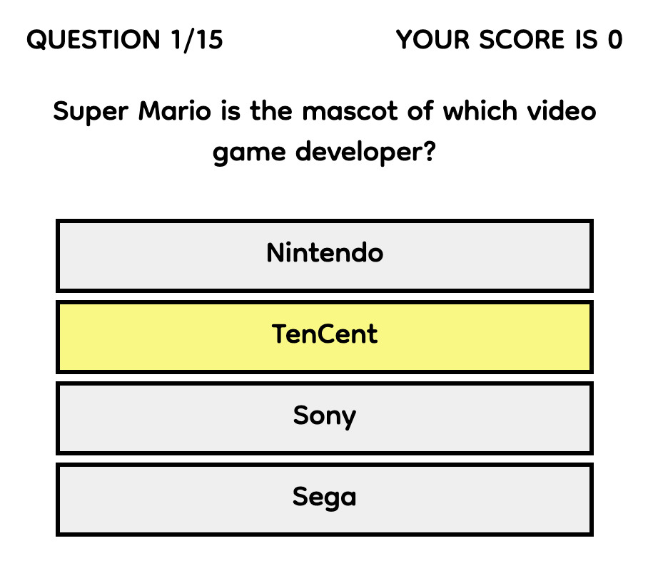
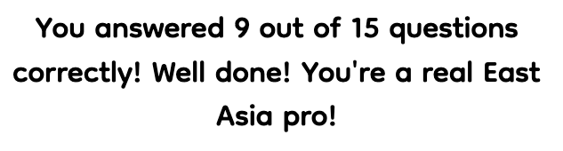

<h2 align="center">Smart panda quiz</h2>

[Find the project here](https://lienebriede.github.io/smart-panda-quiz/).

This is a short trivia game about the countries of East Asia. It is designed to be responsive and accessible on a wide range of devices.

<h2 align="center"></h2>

## User Experience (UX)

-   ### Site Owner's Goals

- The game should test the player's knowledge about the culture of the countries of East Asia.
- The game should be visually appealing.
- The game should give simple and clear instructions.
- The game should include visuals to make it more appealing.
- The game should be short so players don't lose interest in playing.
- The questions should vary in difficulty to make it interesting for a wide range of players.
- Players should get feedback on every question to make it more fun and educational.
- There should be several score display messages depending on the player's score.
- The game should run smoothly on a wide range of devices.

- ### Player's Goals

- The game should be fun to play.
- The questions should vary in difficulty to make it interesting.
- Players should recieve feedback on their answers to make it more fun and educational.
- There should be a score displayed with a message on how well the player did.
- The game should run smoothly on a wide range of devices.

-   ### Design
    
    #### Colour Scheme

    These colors were used for the quiz:
    

    #### Typography

    The font used for the quiz is Dongle with Sans Serif as the fallback font. Dongle is a rounded font that gives a playful and fun touch.

    #### Imagery

    A graphic image of panda is used as a logo for the quiz. 
    
    

    
    A different GIF is used depending on the player's result.

    
    
    
    
    
    ## Features

    There are 15 questions. Every question loads with an updated number. The score is also updated with each correctly answered question.

      

    If the question is answered correctly, the button color changes to green. If answered wrongly, the button changes to red. At the same time the correct answer changes to green, revealing the correct answer.

    

    In addition to the colors, there is also a right/wrong alert at the bottom with a piece of information regarding the answer.

    
    

    In the desktop version the answer buttons have a hover effect that changes the button color to yellow.
    
    

    There are three different score messages that are displayed at the end of the game, depending on the points scored.

    
    
    

    The game has a starting page that contains two buttons giving the options to start the game or read the instructions.

    

    The instructions page can be closed by clicking the X mark in the left top corner and brings the player back to the start page.

    

    When clicking on the logo the player is brought back to the start page at any time during the game.

    ## Future Adaptations

    The game can potentially grow by adding questions to it. Another feature that can be implemented is different difficulty levels that can be unlocked only by achieving a certain score in the previous level, e.g. Easy level, Hard level, Pro level.

    ## Technologies Used

    ### Languages Used

    -   [HTML5](https://en.wikipedia.org/wiki/HTML5)
    -   [CSS3](https://en.wikipedia.org/wiki/Cascading_Style_Sheets)
    -   [JavaScript](https://en.wikipedia.org/wiki/JavaScript)

### Frameworks, Libraries & Programs Used

1. [Google Fonts:](https://fonts.google.com/)
    Google fonts were used to import the fonts into the style.css file which is used on all pages throughout the project.
1. [Font Awesome:](https://fontawesome.com/)
    Font Awesome was used to add icons for aesthetic and UX purposes.
1. [Git:](https://git-scm.com/)
    Git was used for version control by utilizing the Gitpod terminal to commit to Git and Push to GitHub.
1. [GitHub:](https://github.com/)
    GitHub is used to store the projects code after being pushed from Git.
1. [Adobe Photoshop:](https://www.adobe.com/ie/products/photoshop.html) 
    Adobe Photoshop was used for gif editing.
1. [Adobe Illustrator:](https://www.adobe.com/ie/products/illustrator.html) 
    Adobe Illustrator was used to make the logo of the quiz.
1. [Balsamiq:](https://balsamiq.com/)
    Figma was used to create the wireframes during the design process.
1. [Pinterest:](https://pinterest.com/)
    Gifs from Pinterest were used for styling the game.
1. [VSCode:](https://code.visualstudio.com/)
    VS Code was used for the development environmet.
1. [GoogleDevTools:](https://developer.chrome.com/docs/devtools/)
    Google Dev Tools was used for testing and troubleshooting.

### Wireframes

Before the web development process all pages were designed using [Balsamiq](https://balsamig.com/).

 

## Testing

- The [W3C Markup Validator](https://validator.w3.org/), [W3C CSS Validator](https://jigsaw.w3.org/css-validator/) and [JSHint JavaScript Validator](https://jshint.com/) services were used to validate every page of the project to ensure there were no syntax errors in the project.

- The Website was tested on Google Chrome and Safari browsers. It was also tested on a variety of devices using [Chrome DevTools](https://developer.chrome.com/docs/devtools/).

- The Website was tested using Google Chrome Lighthouse Tool. The Accessability score on both mobile and desktop version is 100.

    Results for mobile version
 

    Results for desktop version
 

- Friends were asked to review the site and give feedback.

## Bugs

While testing, a bug was found in the code. It was most obvious in the desktop version. If the user clicks somewhere between the buttons, the whole button area turns red. This was due to targeting the whole answer buttons div in JavaScript code when adding the event listener to the answer buttons. The event listener should target each button rather than the whole div. 

## Deployment

### GitHub Pages

The project was deployed to [GitHub Pages](https://pages.github.com/). These steps were followed:
1. Log in to your Github.
2. Find the [Smart panda quiz repository](https://github.com/lienebriede/smart-panda-quiz).
3. Select Settings (top-right corner in the navigation menu).
4. Select Pages (left handside of the website).
5. Choose: Deploy from a branch as Source.
6. Choose:  
Source - Deploy from a branch  
Branch - main /root & Save  
7. Select Code (top-left corner in the navigation menu).
8. Select Deployment (right handside of the webpage).
9. Go to the live website by clicking the icon with the arrow (on the right side).

## Credits

#### Code

These Youtube tutorials were used to understand the process of making a quiz in JavaScript:

- [How To Make Quiz App Using JavaScript | Build Quiz App With HTML CSS & JavaScript by GreatStack](https://www.youtube.com/watch?app=desktop&v=PBcqGxrr9g8)

- [Build A Quiz App With JavaScript by Web Dev Simplified](https://www.youtube.com/watch?v=riDzcEQbX6k)

Information of how JavaScript works and how to apply it to the quiz was acquired from [W3Schools](https://www.w3schools.com/js/default.asp).

Bits of code were learnt and applied from [Stack Overflow](https://stackoverflow.com/).

#### Content

All content was written by the developer.

### Thanks

To Charlie Bell and my mentor Jack Wachira for their support and encouragment.

